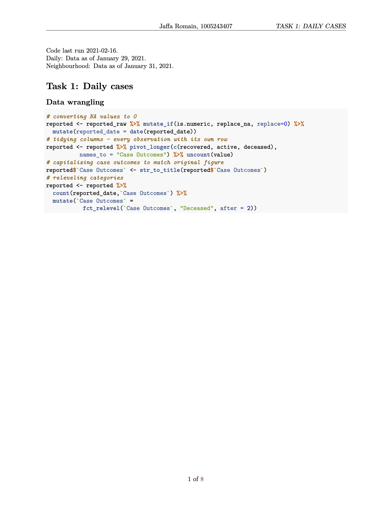
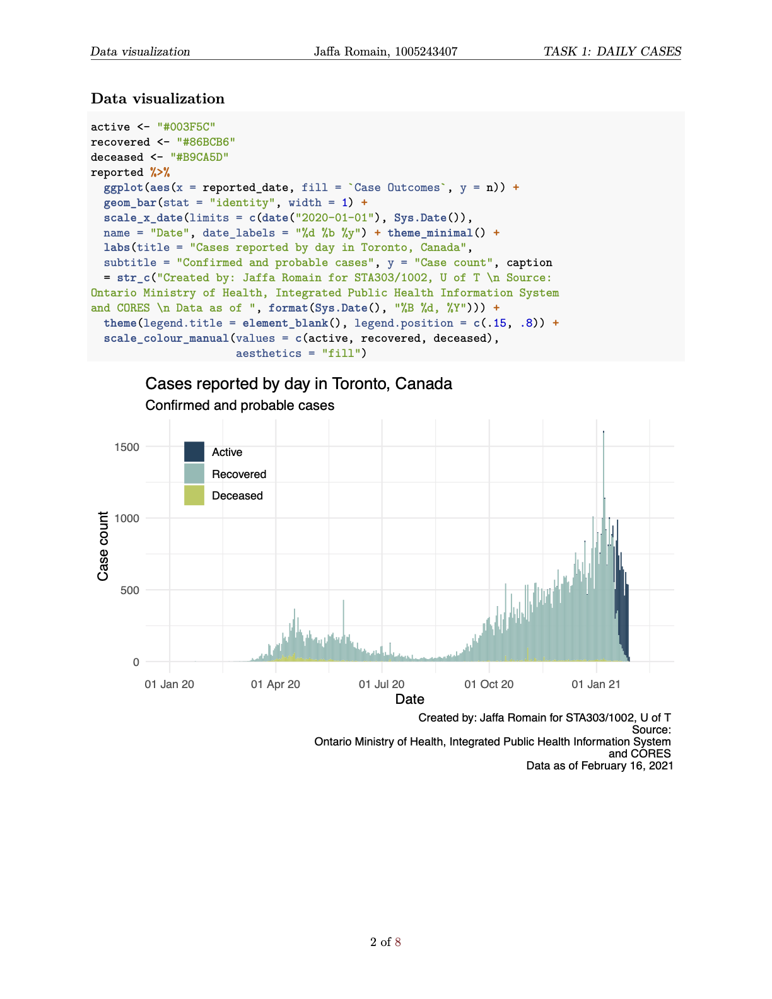
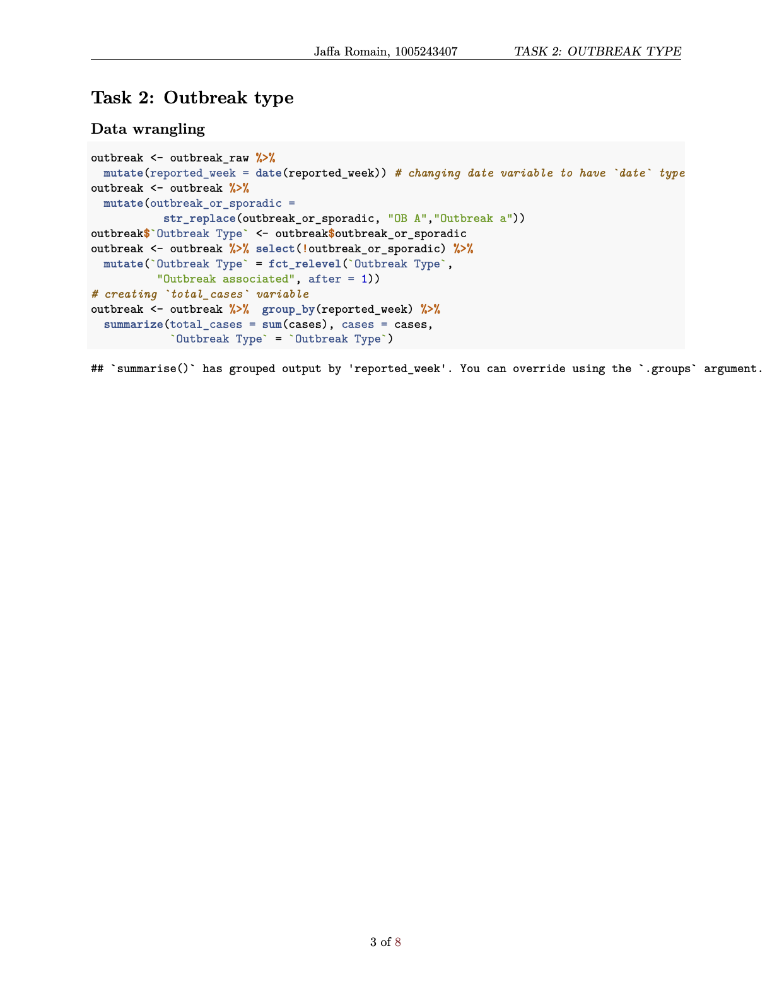
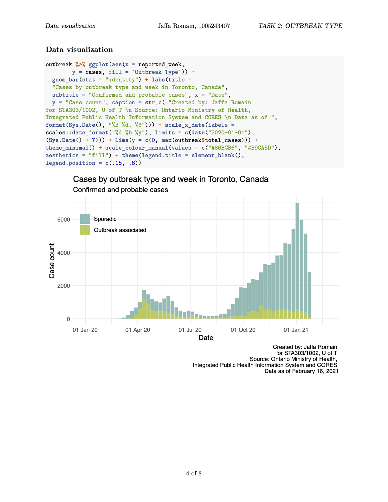
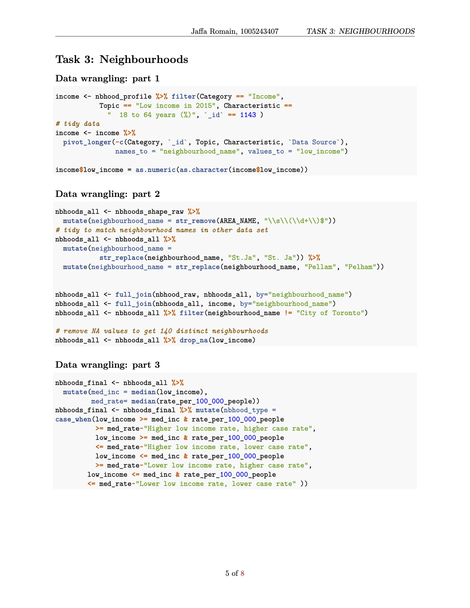
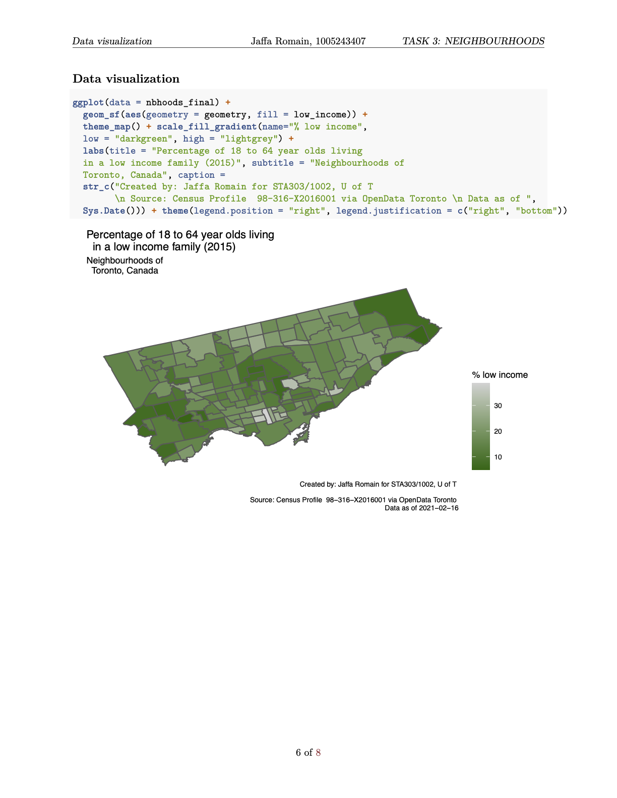
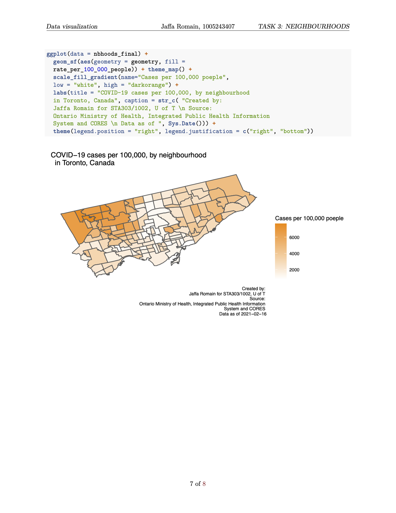
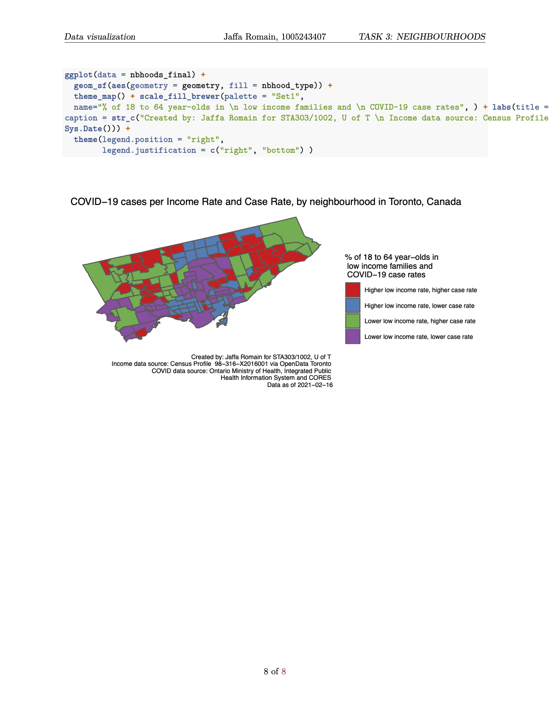

A data exploration project for STA303. Using data from the Toronto COVID Portal, neighbourhood profile data from the 2016 census, and OpenData Toronto portal, data visualizations were created to show cases by day, cases by outbreak type and week, and Toronto neighbourhood trends.

Code last run 2021-02-16
Daily Data as of January 29, 2021
Neighbourhood: Data as of January 31, 2021
```{r setup, include=FALSE}
knitr::opts_chunk$set(collapse = TRUE)
library(tidyverse)
library(dplyr)
library(knitr)
```

```{r, echo=FALSE}










```

