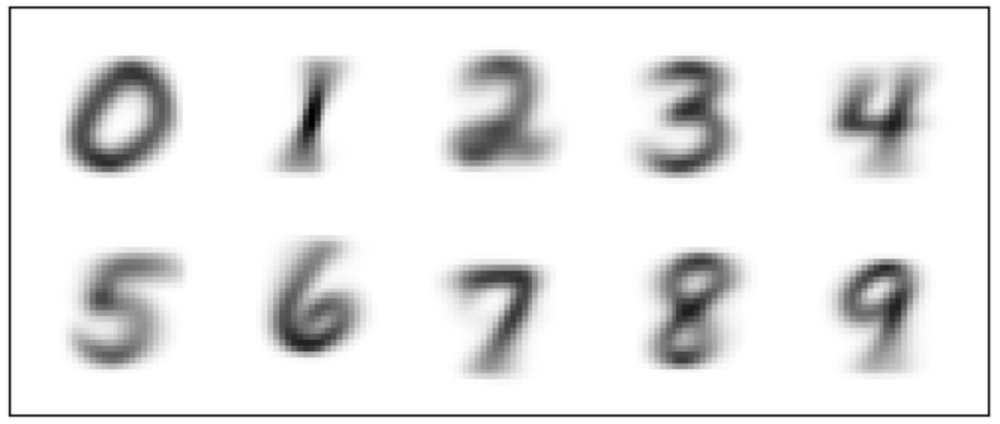

```{r setup, include=FALSE}
knitr::opts_chunk$set(collapse = TRUE)
library(tidyverse)
library(dplyr)
library(knitr)
```
## MNIST Classifier
```{r, echo=FALSE, message=FALSE}

```

MNIST classifier implemented with scipy. A Naive Bayes model was used to fit the MNIST digits using maximum likelihood with 81.6% test accuracy. 

code can be found at: https://github.com/jaffaromain/ML-coursework/tree/main/Naive%20Bayes

## Canadian Social Survey Analysis

We used data from the 2020 General Social Survey to build a Logistic Regression model that provided more insight on possible predictors of home ownership. Our findings suggested that single respondents and those with a lower income had an increased likelihood of a family renting.

code can be found at: https://github.com/jaffaromain/Canadian-Social-Survey-Analysis/blob/main/ps3.pdf

